# Cloud Development Platform Architecture

**Enterprise Architecture transformation case study — TOGAF 10 / ArchiMate**

This repository presents an architecture project, not an executable software application.  
The project designs a transformation of software delivery in a large industrial enterprise: from fragmented, workstation-dependent development and manual production deployment to a standardized **Cloud Development Platform**, stronger engineering capabilities, an explicit architecture function, and a staged migration roadmap.

The original work was created as a graduation project for an Enterprise Architecture / TOGAF 10 course. The public edition keeps the authored architecture artifacts and removes course-management and historical repository noise.

> **Role:** enterprise architecture, stakeholder analysis, capability-based planning, baseline/target architecture, organization design, GAP analysis, risk/readiness assessment, and migration planning.

## Project at a glance

### 1. Starting point

The baseline organization has a dedicated software-development function and its own data-center infrastructure, but the delivery model has structural constraints: local environment-dependent builds, weak testing, manual transfer/deployment into production, overlapping team responsibilities, and no explicit enterprise architecture function.

### 2. Capability transformation

The architecture work starts from business drivers and capabilities rather than from a predefined technology stack. The capability map identifies the areas that must change to achieve the target delivery outcomes.

### 3. Target enterprise / solution architecture

The target model spans business, application and technology layers. It connects software-delivery activities with development-platform services and infrastructure. In the graduation case, the **Sfera / Nota** stack is used as one concrete SBB realization; the architecture reasoning remains separable from that product choice.

### 4. Migration, not a big-bang replacement

GAPs are converted into work packages and sequenced into a staged transformation roadmap.

## What was designed

| Architecture area | Artifact |
|---|---|
| Motivation | stakeholder drivers, problems, goals and project success metrics |
| Strategy | capability map and capability priorities |
| Change readiness | transformation-readiness assessment and communication implications |
| Risk | initial/residual risk assessment and project risk heatmap |
| Business architecture | AS-IS and TO-BE software-delivery value streams |
| Organization | baseline architecture function and target competency/project-team model |
| Application & technology | baseline/target architecture and ABB/SBB realization |
| Transition | GAP analysis, transformation stages, work packages and migration roadmap |

## Visual walkthrough

The most important original presentation artifacts are available in  
**[Visual walkthrough](docs/visual-walkthrough.md)**.

For the complete 19-slide authored presentation, see  
**[Diploma presentation (PDF)](docs/diploma-presentation-public.pdf)**.

## Architecture storyline

```mermaid
flowchart LR
    A[Current situation] --> B[Stakeholders & motivation]
    B --> C[Capability assessment]
    C --> D[Readiness & risk]
    D --> E[AS-IS value stream]
    E --> F[TO-BE value stream]
    F --> G[Target architecture]
    G --> H[Organization design]
    H --> I[GAP analysis]
    I --> J[Migration roadmap]
```

## Source-model scale

| Artifact | Count |
|---|---:|
| ArchiMate elements | 487 |
| Relationships | 847 |
| ArchiMate views | 20 |
| Supporting canvas views | 4 |

The model spans Motivation, Strategy, Business, Application, Technology, and Implementation & Migration concepts.

## Further documentation

- [Case context](docs/case-context.md)
- [Architecture approach](docs/architecture-approach.md)
- [Decisions and trade-offs](docs/decisions-and-tradeoffs.md)
- [Supporting analysis](docs/supporting-analysis.md)
- [Transformation roadmap](docs/transformation-roadmap.md)
- [Model inventory](docs/model-inventory.md)
- [Origin and publication boundary](ORIGIN.md)

## Publication boundary

The public portfolio version does not reproduce historical Git metadata, course task-management files, credentials, internal endpoints, or unrelated working artifacts. The screenshots above are rendered from the original authored graduation presentation and retain their original Russian labels; the repository narrative and captions provide the English interpretation.
