# Cloud Development Platform Architecture

Enterprise architecture transformation case study for a **Cloud Development Platform (CDP)**, developed with TOGAF 10 concepts and modeled in ArchiMate.

The case follows a transformation from fragmented software delivery practices to a standardized engineering platform and supporting organizational capabilities. It covers motivation, capabilities, value streams, baseline and target architecture, organizational change, gap analysis, risk/readiness assessment, and migration planning.

> **Role:** enterprise architecture, stakeholder and capability analysis, baseline/target architecture, organizational design, gap analysis, risk/readiness assessment, and migration roadmap.
>
> **Origin:** independently authored graduation project for an Enterprise Architecture / TOGAF 10 course in 2024. This public edition restructures the original study as a portfolio case and removes course scaffolding, historical Git metadata, and non-essential personal/internal data.

## Architecture problem

The baseline delivery model showed recurring systemic constraints:

- responsibilities distributed across teams without clear capability ownership;
- developer environments and local builds dependent on workstation configuration;
- insufficient automated testing and quality gates;
- manual transfer and deployment of releases into production;
- architecture decisions made locally by delivery teams without an explicit enterprise architecture function;
- growing delivery demand combined with uneven engineering competencies.

The target state introduces a shared development platform, reusable engineering capabilities, clearer architecture governance, and a staged transformation roadmap.

## Transformation storyline

```mermaid
flowchart LR
    A[Stakeholders & drivers] --> B[Motivation model]
    B --> C[Capability assessment]
    C --> D[AS-IS value stream]
    D --> E[Baseline architecture]
    E --> F[Target capabilities]
    F --> G[TO-BE value stream]
    G --> H[Target architecture]
    H --> I[Gap analysis]
    I --> J[Organization design]
    J --> K[Risk & readiness assessment]
    K --> L[Migration roadmap]
```



## Selected architecture views

### Motivation and measurable outcomes

Stakeholder concerns and external/internal drivers are connected to problems, goals, and measurable outcomes. The model is used to maintain traceability from transformation drivers to target-state changes.


### Capability map

The capability model identifies the business and engineering capabilities required to improve delivery quality and lead time. Capability prioritization provides the bridge between strategic goals and architecture work.


### Software delivery value stream — AS-IS

The baseline value stream exposes structural problems such as cross-functional responsibility leakage, workstation-dependent builds, weak testing, and manual release handoff.


### Software delivery value stream — TO-BE

The target value stream introduces standardized platform capabilities and automation, with explicit traceability to the baseline problems and target capabilities.


### Organizational architecture

The case treats organization design as part of the architecture transformation, not as a separate HR exercise. It evaluates the baseline architecture function and proposes a target model with reusable competency pools and project-specific architecture teams.

**Baseline**


**Target**


### Target architecture

The target model spans business, application, and technology layers and connects delivery activities with platform services, engineering systems, and infrastructure. The original study used a commercial Russian development-platform stack as one illustrative SBB choice; the architectural reasoning is independent of that vendor selection.


### Migration roadmap

The identified gaps are grouped into staged work packages instead of attempting a big-bang transformation. The roadmap is aligned with organizational readiness and risk-reduction measures.


## Scope of the original model

The source ArchiMate model contains:

| Artifact | Count |
|---|---:|
| ArchiMate elements | 487 |
| Relationships | 847 |
| ArchiMate views | 20 |
| Supporting canvas views | 4 |

The model spans Motivation, Strategy, Business, Application, Technology, and Implementation & Migration concepts. See [model inventory](docs/model-inventory.md) for the view catalogue and major element types.

## Architecture methods demonstrated

| Area | Evidence in this case |
|---|---|
| Stakeholder management | stakeholder identification, concerns, influence/interest analysis, communication planning |
| Motivation | drivers, assessments, goals, outcomes, requirements and measurable success criteria |
| Capability-based planning | capability map, prioritization and heat-map analysis |
| Value-stream analysis | baseline and target software-delivery value streams |
| Baseline / target architecture | business, application and technology-layer models |
| Building blocks | ABB/SBB grouping and REST API modeling examples |
| Gap analysis | baseline-to-target gap catalogue and dependency analysis |
| Organization design | baseline architecture function, target competency model and project-team composition |
| Risk management | project risk identification, mitigation and residual-risk assessment |
| Change readiness | readiness factors, stakeholder assessment and staged transformation recommendation |
| Implementation & migration | plateaus, work packages, deliverables and migration roadmap |

## Repository structure

```text
.
├── README.md
├── ORIGIN.md
├── assets/
│   └── diagrams/
├── docs/
│   ├── architecture-approach.md
│   ├── case-context.md
│   ├── decisions-and-tradeoffs.md
│   ├── model-inventory.md
│   ├── supporting-analysis.md
│   └── transformation-roadmap.md
└── .gitignore
```

## Notes on the public edition

The original working repository also contained course task descriptions, spreadsheet working files, presentation sources, and historical Git metadata. They are intentionally not copied verbatim into this repository. The public edition preserves the architecture reasoning and selected authored diagrams while removing educational scaffolding and provenance noise.

Diagram labels are retained in Russian to preserve the original authored artifacts; the surrounding documentation provides the English interpretation.

## Further reading

- [Case context](docs/case-context.md)
- [Architecture approach](docs/architecture-approach.md)
- [Decisions and trade-offs](docs/decisions-and-tradeoffs.md)
- [Supporting analysis](docs/supporting-analysis.md)
- [Transformation roadmap](docs/transformation-roadmap.md)
- [Model inventory](docs/model-inventory.md)
- [Origin and publication boundary](ORIGIN.md)
