# Cloud Development Platform Architecture

  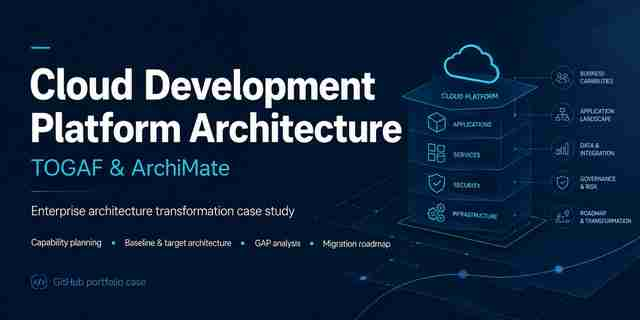

**Enterprise Architecture transformation case study — TOGAF 10 / ArchiMate**

This repository presents an architecture project for transforming software delivery in a large industrial organization. The baseline relies on workstation-dependent builds, weak testing and manual transfer/deployment into production. The target state introduces a standardized development platform, automated quality and delivery practices, explicit architecture capabilities, organizational changes and a staged migration roadmap.

> **Role:** enterprise architecture, stakeholder analysis, capability-based planning, AS-IS / TO-BE modeling, target architecture, organization design, GAP analysis, risk/readiness assessment and migration planning.
>
> **Origin:** independently authored graduation project for an Enterprise Architecture / TOGAF 10 course in 2024. The public edition is a curated portfolio version of the author's work.

## Project at a glance

### 1. Baseline and objective

The starting point is a low-maturity software-delivery model: development teams perform responsibilities outside their core competencies, builds depend on local workstation environments, testing is weak, and releases are transferred and deployed manually into production.

The transformation objective is to reduce production defects and downtime while shortening delivery lead time. The solution is treated as an **enterprise change**, not only a tooling replacement: capabilities, organization, processes, application services, infrastructure and migration are designed together.

### 2. Motivation and capability-based planning

Stakeholder concerns and diagnosed problems were translated into goals and measurable outcomes. The motivation model links technology evolution, project growth and service-quality expectations with the concrete changes required in people, engineering practices and delivery performance.

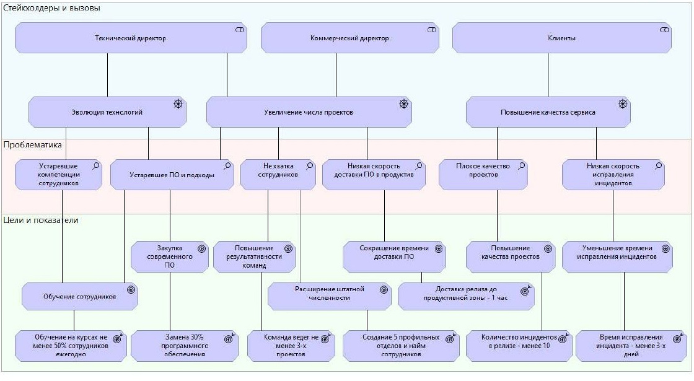

The capability map then identifies and prioritizes the organizational abilities needed to reach the target state before selecting concrete Solution Building Blocks.

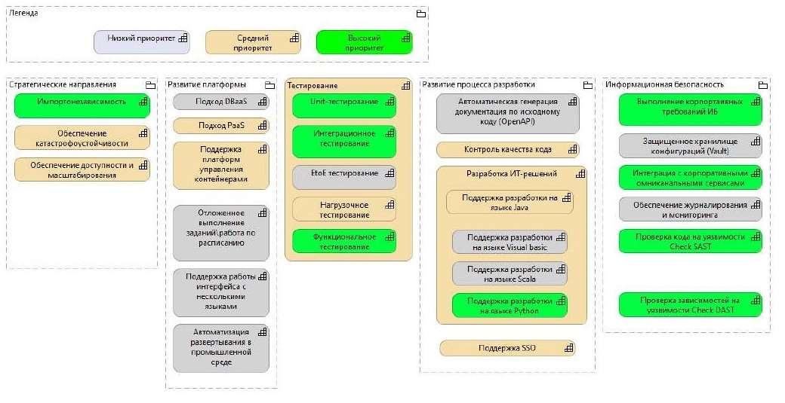

### 3. Delivery model: AS-IS → TO-BE

The baseline value stream exposes responsibility overlap, environment-dependent local builds, insufficient testing and manual deployment.

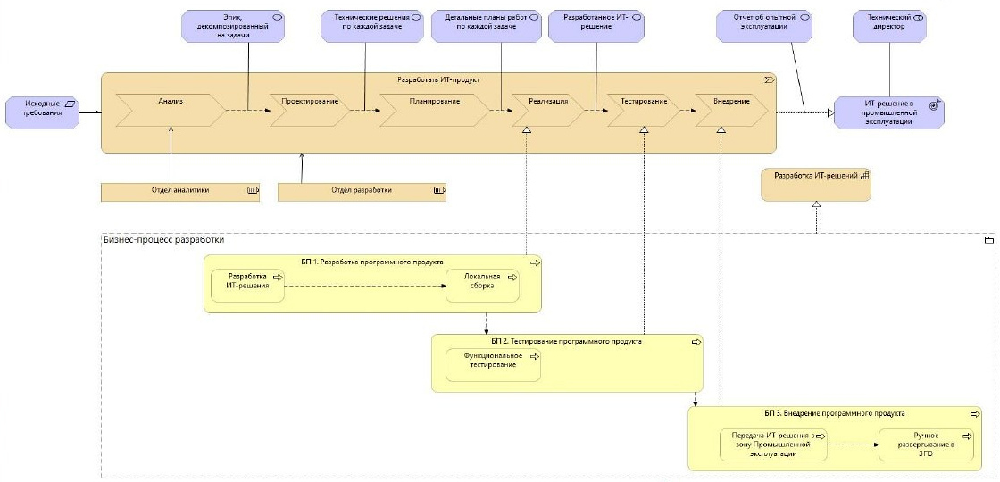

The target value stream introduces explicit architecture, testing and engineering responsibilities together with automated build, quality-control and delivery stages.

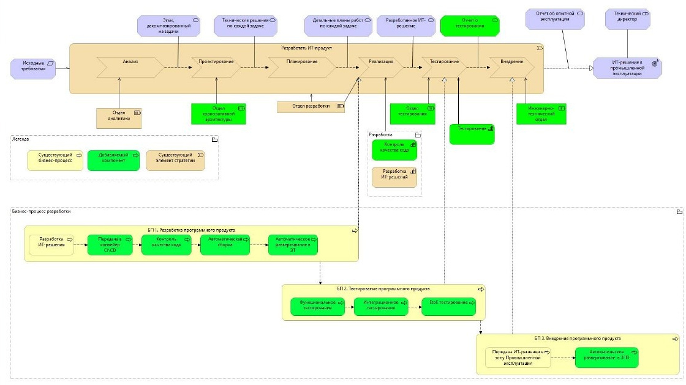

### 4. Target architecture

The target architecture spans **business, application and technology layers**. The full model is intentionally split below into focused extracts so that the architecture remains readable on a GitHub page.

#### Business layer

The business view connects the target delivery process with organizational roles and responsibilities introduced by the transformation.

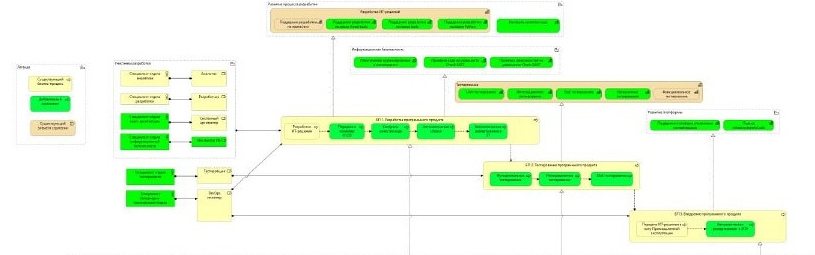

#### Application layer

The application view shows the development-platform services supporting source management, build, testing, quality controls, knowledge/project management and delivery automation. In the original study, the **Sfera / Nota** product family is used as one concrete SBB realization; the architecture reasoning remains separable from that product choice.

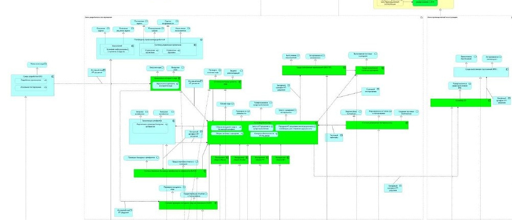

#### Technology layer

The technology view places the development platform and application execution environments on the target infrastructure and operating-system/container foundation.

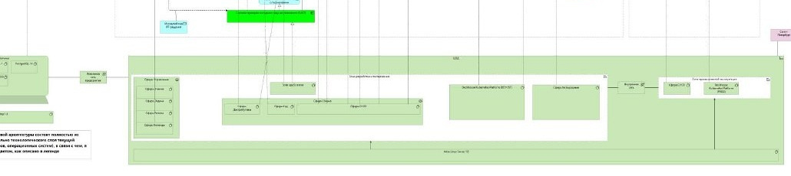

The complete multi-layer source view is available in the [visual walkthrough](docs/visual-walkthrough.md).

### 5. GAP analysis and staged migration

The baseline-to-target GAP analysis covers organization, infrastructure, business processes and software. It provides the change inventory from which migration work packages are formed.

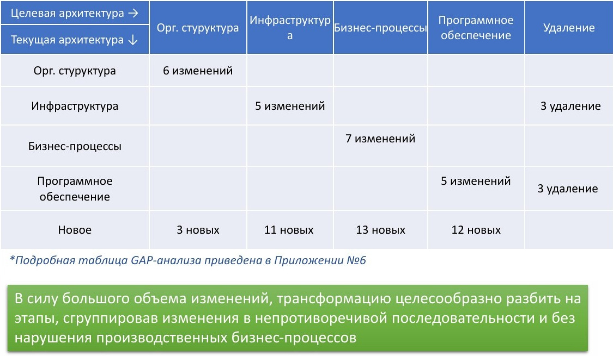

The transformation is deliberately staged rather than implemented as a big-bang replacement: first the organizational and infrastructure foundation, then development/process-management capabilities, followed by production-zone and platform evolution.

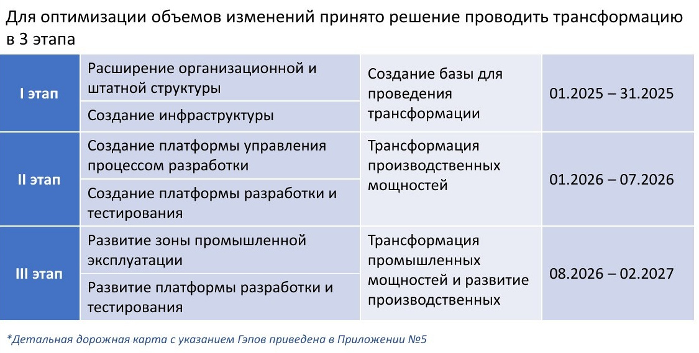

For deeper review, see the [detailed migration roadmap](assets/diagrams/13-detailed-roadmap.jpg) and [full GAP matrix](assets/diagrams/14-detailed-gap-matrix.jpg).

## What was designed

| Architecture area | Evidence in the case |
|---|---|
| Motivation | stakeholder drivers, problems, goals and measurable project outcomes |
| Strategy | capability map and prioritization |
| Change readiness | assessment domains, stakeholder interviews and transformation recommendation |
| Risk | initial/residual risk assessment, mitigation measures and risk heatmap |
| Business architecture | AS-IS and TO-BE software-delivery value streams |
| Organization | baseline architecture function and target competency/project-team model |
| Application & technology | target multi-layer architecture and concrete SBB realization |
| Transition | GAP analysis, staged work packages and detailed migration roadmap |

## Explore the full case

The README uses focused crops for readability. The **[Visual walkthrough](docs/visual-walkthrough.md)** preserves the complete presentation slides and supporting architecture evidence.

For the complete sanitized project presentation, including readiness assessment, risk analysis, organization design, functional-role models, target architecture, detailed roadmap and GAP matrix, see the **[Public presentation (PDF)](docs/diploma-presentation-public.pdf)**.

## Architecture storyline

```mermaid
flowchart LR
    A[Current situation] --> B[Stakeholders & motivation]
    B --> C[Capability assessment]
    C --> D[Readiness & risk]
    D --> E[AS-IS value stream]
    E --> F[TO-BE value stream]
    F --> G[Target architecture]
    G --> H[Organization design]
    H --> I[GAP analysis]
    I --> J[Migration roadmap]
```

## Source-model scale

| Artifact | Count |
|---|---:|
| ArchiMate elements | 487 |
| Relationships | 847 |
| ArchiMate views | 20 |
| Supporting canvas views | 4 |

The underlying model spans Motivation, Strategy, Business, Application, Technology, and Implementation & Migration concepts.

## Further documentation

- [Case context](docs/case-context.md)
- [Architecture approach](docs/architecture-approach.md)
- [Decisions and trade-offs](docs/decisions-and-tradeoffs.md)
- [Supporting analysis](docs/supporting-analysis.md)
- [Transformation roadmap](docs/transformation-roadmap.md)
- [Model inventory](docs/model-inventory.md)
- [Origin and publication boundary](ORIGIN.md)

## Publication boundary

The public portfolio edition does not include the original repository history, course-management scaffolding, raw working spreadsheets, source PowerPoint, credentials or environment-specific configuration. The personal biography slide and employer-specific identifying details are removed from the public PDF. Product names shown in the architecture are public technology/SBB references and do not imply affiliation or endorsement.
