# Cloud Development Platform Architecture

**Enterprise Architecture transformation case study — TOGAF 10 / ArchiMate**

This repository presents an architecture project for transforming software delivery in a large industrial organization. The baseline relies on local workstation-dependent builds, weak testing and manual transfer/deployment into production. The target state introduces a standardized development platform, automated quality and delivery practices, explicit architecture capabilities, organizational changes and a staged migration roadmap.

> **Role:** enterprise architecture, stakeholder analysis, capability-based planning, AS-IS / TO-BE modeling, target architecture, organization design, GAP analysis, risk/readiness assessment and migration planning.
>
> **Origin:** independently authored graduation project for an Enterprise Architecture / TOGAF 10 course in 2024. The public edition is a curated portfolio version of the author's work.

## Project at a glance

### 1. Baseline and objective

The project starts from a low-maturity delivery model and defines the target outcome: reduce production defects and downtime while shortening the path from development to production. The public edition generalizes the organization profile and removes employer-specific information.

### 2. Motivation and capability-based planning

Stakeholder concerns and diagnosed problems were translated into goals and measurable outcomes. A capability map was then used to identify which organizational abilities had to be strengthened before selecting concrete solution building blocks.

### 3. Delivery model: AS-IS → TO-BE

The baseline value stream exposes four core constraints: responsibilities crossing competency boundaries, environment-dependent local builds, weak testing and manual deployment. The target value stream introduces architecture, testing and engineering responsibilities plus automated build, quality and delivery stages.

### 4. Target architecture

The complete target model spans business, application and technology layers. In the original study the **Sfera / Nota** product family is used as one concrete SBB realization; the architectural reasoning remains separable from that product choice.

### 5. GAP analysis and staged migration

The baseline-to-target GAP analysis covers organization, infrastructure, business processes and software. The change set is grouped into staged work packages rather than treated as a big-bang replacement.

The detailed GAP matrix is also published as a direct source render: [full GAP matrix](assets/diagrams/14-detailed-gap-matrix.jpg).

## What was designed

| Architecture area | Evidence in the case |
|---|---|
| Motivation | stakeholder drivers, problems, goals and measurable project outcomes |
| Strategy | capability map and prioritization |
| Change readiness | assessment domains, stakeholder interviews and transformation recommendation |
| Risk | initial/residual risk assessment, mitigation measures and risk heatmap |
| Business architecture | AS-IS and TO-BE software-delivery value streams |
| Organization | baseline architecture function and target competency/project-team model |
| Application & technology | target multi-layer architecture and concrete SBB realization |
| Transition | GAP analysis, staged work packages and detailed migration roadmap |

## Visual walkthrough

The selected architecture artifacts are available in **[Visual walkthrough](docs/visual-walkthrough.md)**.

For the complete sanitized project presentation, including detailed appendices for readiness, risk, functional-role models and GAP analysis, see **[Public presentation (PDF)](docs/diploma-presentation-public.pdf)**.

The repository images are direct raster renders from the author's **v2 PDF presentation**. They are not reconstructed diagrams and are not re-laid out from the PowerPoint source; this avoids the layer/z-order rendering artifacts that can occur when exporting the source deck in a different runtime.

## Architecture storyline

```mermaid
flowchart LR
    A[Current situation] --> B[Stakeholders & motivation]
    B --> C[Capability assessment]
    C --> D[Readiness & risk]
    D --> E[AS-IS value stream]
    E --> F[TO-BE value stream]
    F --> G[Target architecture]
    G --> H[Organization design]
    H --> I[GAP analysis]
    I --> J[Migration roadmap]
```

## Source-model scale

| Artifact | Count |
|---|---:|
| ArchiMate elements | 487 |
| Relationships | 847 |
| ArchiMate views | 20 |
| Supporting canvas views | 4 |

The underlying model spans Motivation, Strategy, Business, Application, Technology, and Implementation & Migration concepts.

## Further documentation

- [Case context](docs/case-context.md)
- [Architecture approach](docs/architecture-approach.md)
- [Decisions and trade-offs](docs/decisions-and-tradeoffs.md)
- [Supporting analysis](docs/supporting-analysis.md)
- [Transformation roadmap](docs/transformation-roadmap.md)
- [Model inventory](docs/model-inventory.md)
- [Origin and publication boundary](ORIGIN.md)

## Publication boundary

The public portfolio edition does not include the original repository history, course-management scaffolding, raw working spreadsheets, source PowerPoint, credentials or environment-specific configuration. The personal biography slide and employer-specific identifying details are removed from the public PDF. Product names shown in the architecture are public technology/SBB references and do not imply affiliation or endorsement.
