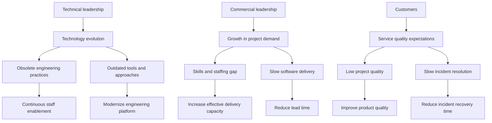
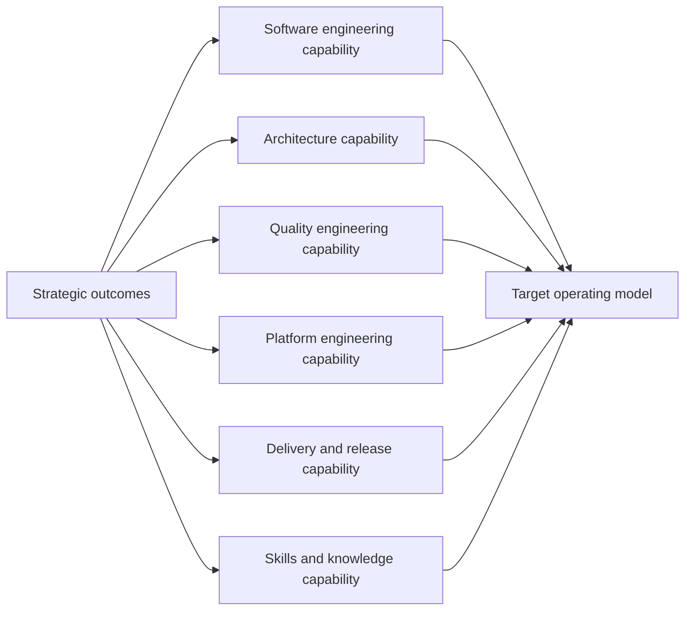
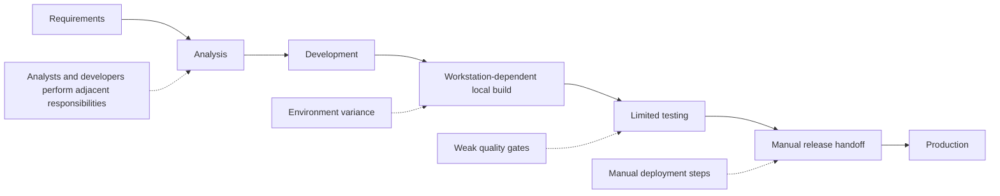
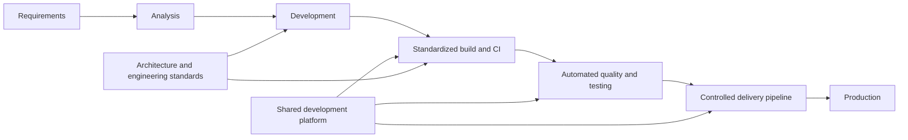
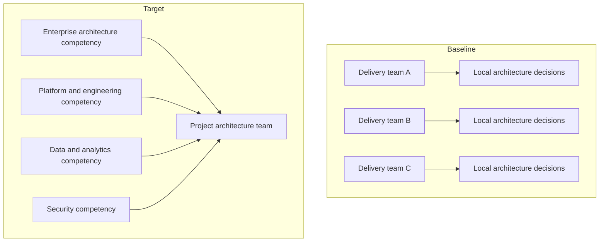
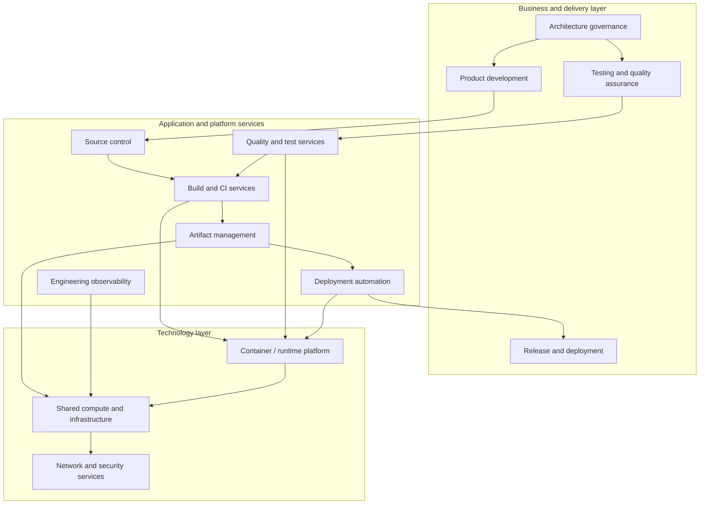
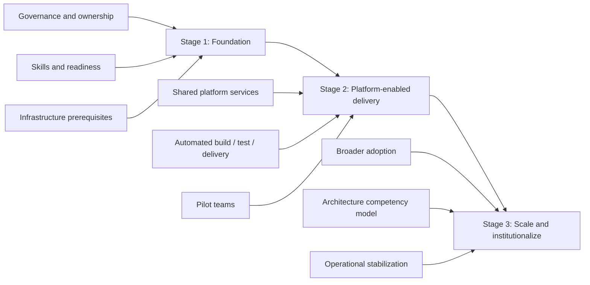

# Cloud Development Platform Architecture

Enterprise architecture transformation case study for a **Cloud Development Platform (CDP)**, developed with TOGAF 10 concepts and modeled in ArchiMate.

The case follows a transformation from fragmented software-delivery practices to a standardized engineering platform and supporting organizational capabilities. It covers motivation, capabilities, value streams, baseline and target architecture, organization design, gap analysis, risk/readiness assessment, and migration planning.

> **Role:** enterprise architecture, stakeholder and capability analysis, baseline/target architecture, organizational design, gap analysis, risk/readiness assessment, and migration roadmap.
>
> **Origin:** independently authored graduation project for an Enterprise Architecture / TOGAF 10 course in 2024. This public edition restructures the original study as a portfolio case and removes course scaffolding, historical Git metadata, and non-essential personal/internal data.

## Architecture problem

The baseline delivery model showed recurring systemic constraints:

- responsibilities distributed across teams without clear capability ownership;
- developer environments and local builds dependent on workstation configuration;
- insufficient automated testing and quality gates;
- manual transfer and deployment of releases into production;
- architecture decisions made locally by delivery teams without an explicit enterprise architecture function;
- growing delivery demand combined with uneven engineering competencies.

The target state introduces a shared development platform, reusable engineering capabilities, clearer architecture governance, and a staged transformation roadmap.

## Transformation storyline

```mermaid
flowchart LR
    A[Stakeholders and drivers] --> B[Motivation model]
    B --> C[Capability assessment]
    C --> D[AS-IS value stream]
    D --> E[Baseline architecture]
    E --> F[Target capabilities]
    F --> G[TO-BE value stream]
    G --> H[Target architecture]
    H --> I[Gap analysis]
    I --> J[Organization design]
    J --> K[Risk and readiness]
    K --> L[Migration roadmap]
```



## Selected architecture views

The original ArchiMate model contains 20 named views. The public walkthrough below reproduces the reasoning in English using simplified GitHub-native diagrams; the detailed model inventory preserves the original view catalogue.

### Motivation and measurable outcomes



The important point is traceability: the target platform is justified through stakeholder concerns, diagnosed problems, goals and measurable outcomes rather than through technology adoption alone.

### Capability-based planning



A capability map and heat-map assessment were used to distinguish **what the organization must be able to do** from the specific applications and technologies later selected to realize those capabilities.

### Software-delivery value stream — AS-IS



### Software-delivery value stream — TO-BE



The TO-BE state moves repeatable engineering work into shared platform capabilities and makes quality controls part of the delivery flow.

### Organizational architecture



The target does not create a review-only architecture silo. It makes architecture an explicit competency and assembles project architecture teams from reusable specialist pools.

### Target architecture



The original study selected a concrete commercial development-platform stack as one SBB realization. In the public case, product choices remain replaceable: the central architecture is expressed through capabilities, services and building blocks.

### Migration roadmap



Gaps were converted into work packages and grouped into staged plateaus rather than treated as a big-bang replacement program.

## Scope of the original model

| Artifact | Count |
|---|---:|
| ArchiMate elements | 487 |
| Relationships | 847 |
| ArchiMate views | 20 |
| Supporting canvas views | 4 |

The model spans Motivation, Strategy, Business, Application, Technology, and Implementation & Migration concepts. See the [model inventory](docs/model-inventory.md) for the view catalogue and major element types.

## Architecture methods demonstrated

| Area | Evidence in this case |
|---|---|
| Stakeholder management | stakeholder identification, concerns, influence/interest analysis, communication planning |
| Motivation | drivers, assessments, goals, outcomes, requirements and measurable success criteria |
| Capability-based planning | capability map, prioritization and heat-map analysis |
| Value-stream analysis | baseline and target software-delivery value streams |
| Baseline / target architecture | business, application and technology-layer models |
| Building blocks | ABB/SBB grouping and REST API modeling examples |
| Gap analysis | baseline-to-target gap catalogue and dependency analysis |
| Organization design | baseline architecture function, target competency model and project-team composition |
| Risk management | project risk identification, mitigation and residual-risk assessment |
| Change readiness | readiness factors, stakeholder assessment and staged transformation recommendation |
| Implementation & migration | plateaus, work packages, deliverables and migration roadmap |

## Repository structure

```text
.
├── README.md
├── ORIGIN.md
└── docs/
    ├── architecture-approach.md
    ├── case-context.md
    ├── decisions-and-tradeoffs.md
    ├── model-inventory.md
    ├── supporting-analysis.md
    └── transformation-roadmap.md
```

## Notes on the public edition

The original working repository contained the complete multi-file ArchiMate model, supporting analysis spreadsheets, a graduation presentation, course task descriptions and historical Git metadata. They are intentionally not copied verbatim into the public repository. This edition preserves the architecture reasoning, model inventory and transformation decisions while removing educational scaffolding and provenance noise.

This repository demonstrates use of TOGAF concepts and ArchiMate modeling; it is a portfolio case study rather than a claim of vendor certification or production implementation.

## Further reading

- [Case context](docs/case-context.md)
- [Architecture approach](docs/architecture-approach.md)
- [Decisions and trade-offs](docs/decisions-and-tradeoffs.md)
- [Supporting analysis](docs/supporting-analysis.md)
- [Transformation roadmap](docs/transformation-roadmap.md)
- [Model inventory](docs/model-inventory.md)
- [Origin and publication boundary](ORIGIN.md)
