# Visual walkthrough

This walkthrough uses direct renders from the author's **v2 project PDF**. The original Russian labels are retained because these are the authored architecture artifacts; the captions below provide a concise English interpretation.

## 1. Project context

Baseline assumptions, project objective and architectural constraints. The public edition generalizes the organization profile while preserving the architecture problem.

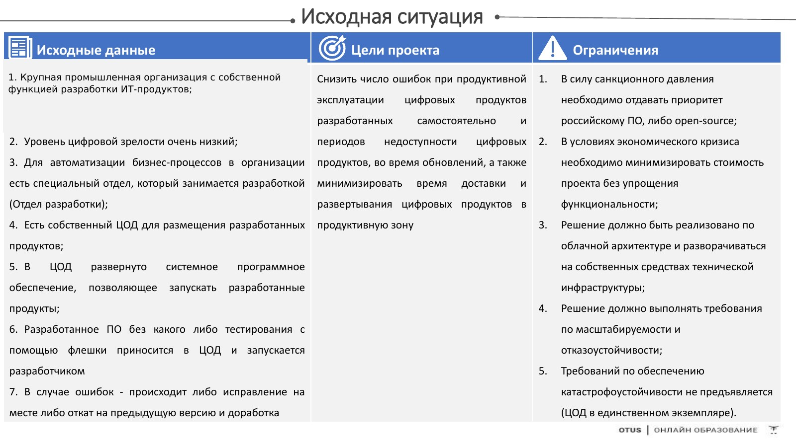

## 2. Motivation model and project metrics

Stakeholder interviews are translated into drivers, problems, goals and measurable success criteria.

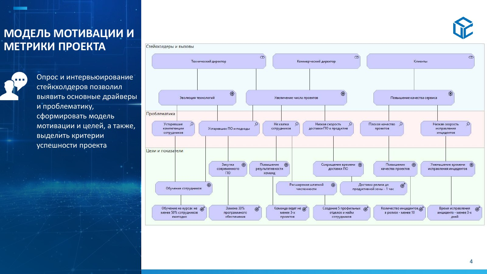

## 3. Capability map

Capability-based planning identifies the organizational abilities needed for the target state and prioritizes them independently of product selection.

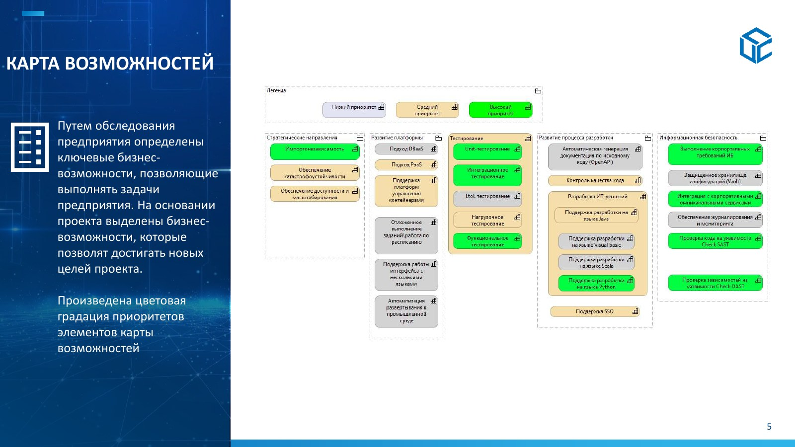

## 4. Change readiness

Readiness is assessed across technology, skills, change culture, engineering practices, security/compliance, investment, change management and accountability. The resulting recommendation is a staged transformation.

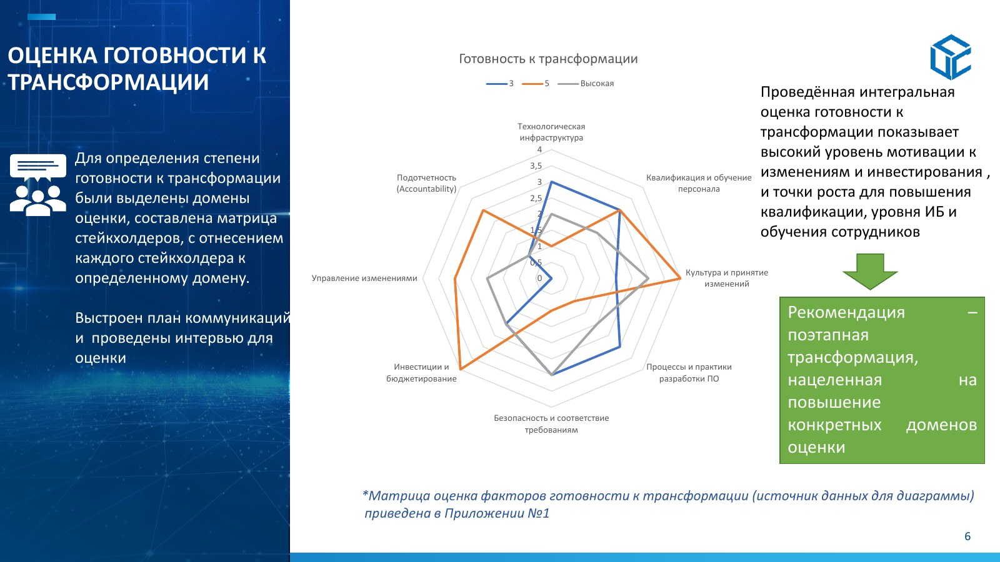

## 5. Software-delivery value stream — AS-IS

The baseline delivery flow exposes responsibility overlap, workstation-dependent builds, weak testing and manual deployment into production.

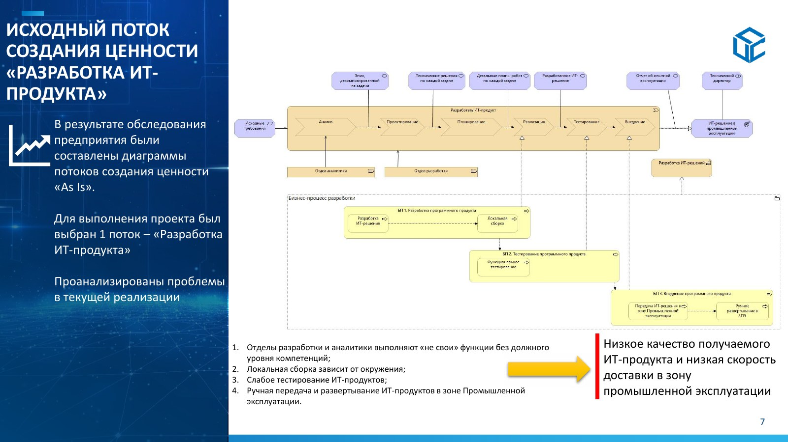

## 6. Software-delivery value stream — TO-BE

The target flow introduces architecture and testing roles together with automated build, code-quality, test and deployment capabilities.

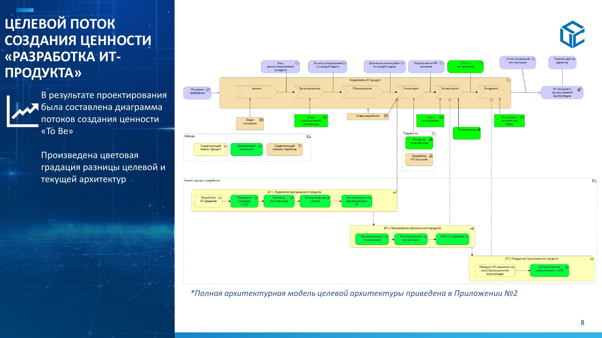

## 7. Architecture function — AS-IS

Architecture is not an explicit organizational function; delivery teams make largely local decisions with limited cross-project coordination.

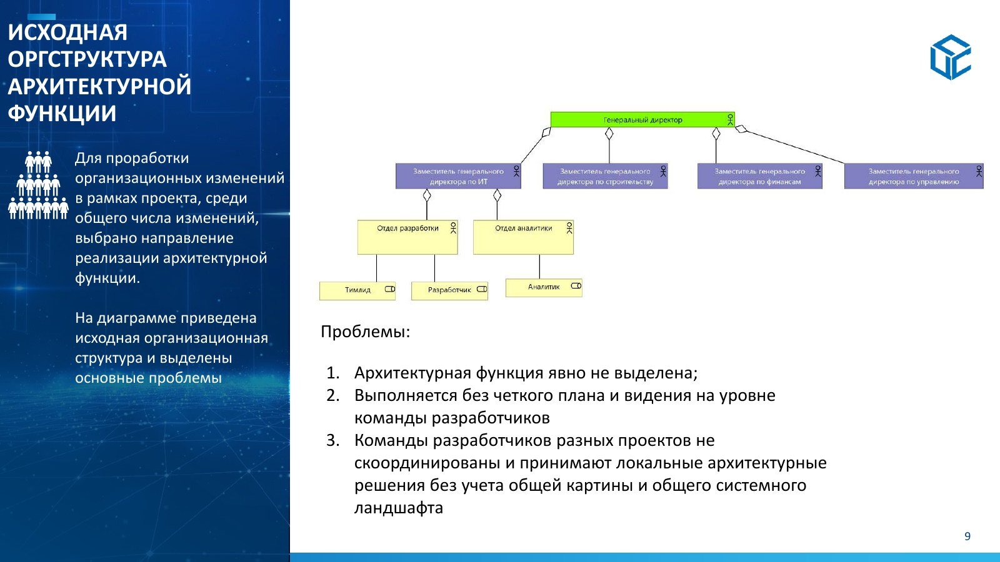

## 8. Architecture function — TO-BE

The target organization establishes dedicated competency units and forms project architecture teams from specialized roles.

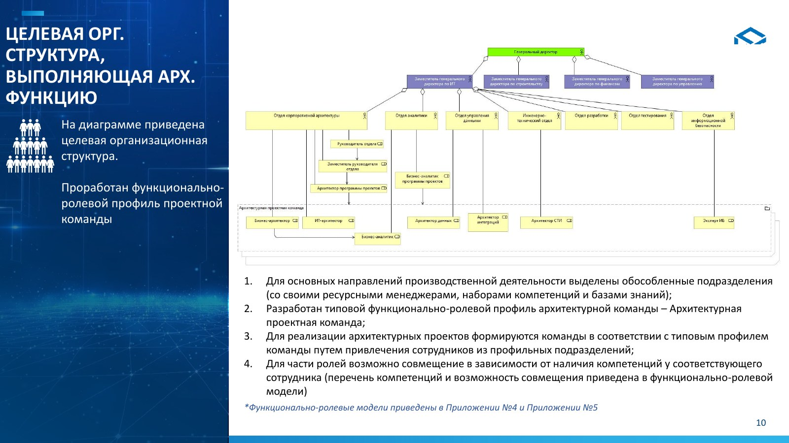

## 9. Project risk assessment

Initial and residual risks are compared after mitigation. Bubble size represents each risk's share of the total exposure.

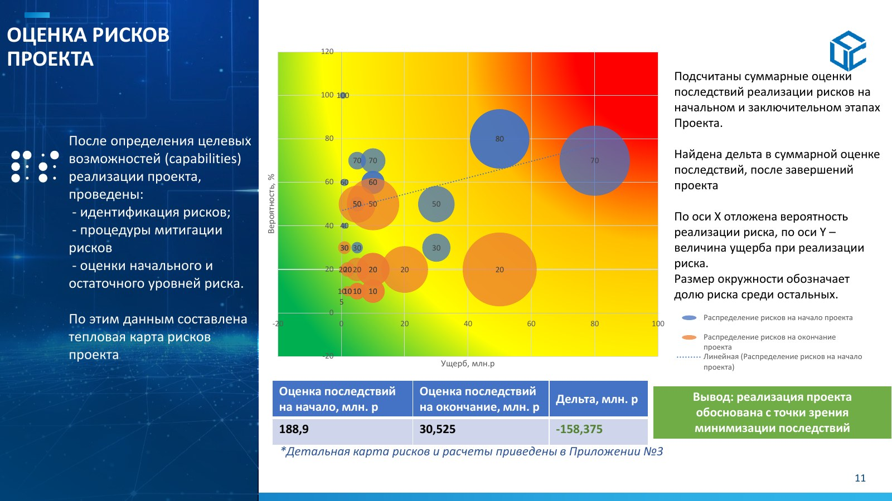

## 10. Aggregated GAP analysis

The summary matrix quantifies changes across organization, infrastructure, business processes and software, including new and removed elements.

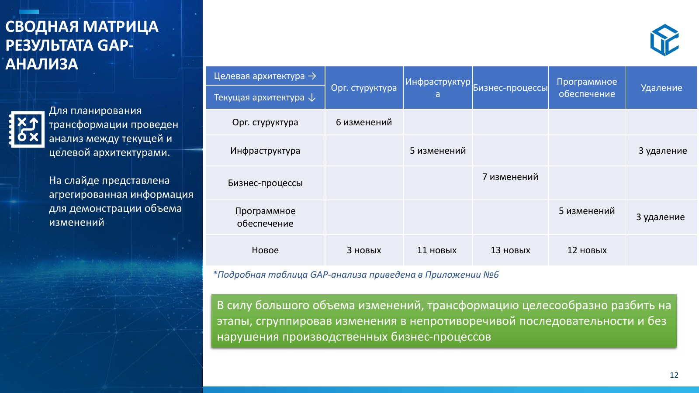

## 11. Transformation stages

The identified gaps are grouped into three stages: establishing the transformation base, transforming production/development capabilities and developing the production zone.

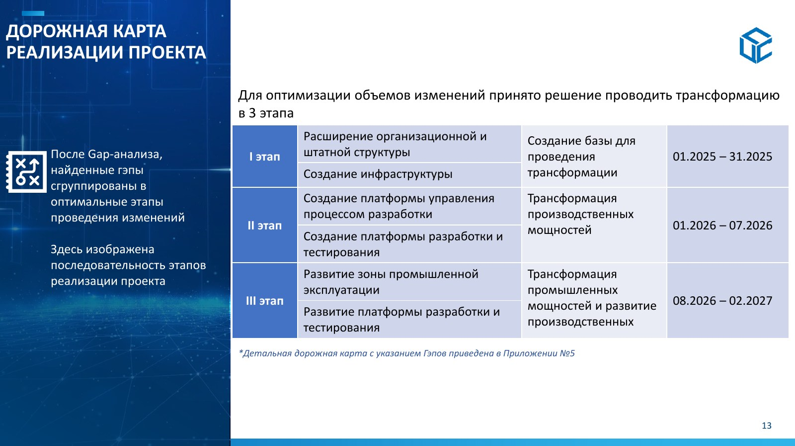

## 12. Complete target architecture

The target view spans organization/business, application/platform and technology/infrastructure layers. Green elements mark target-state additions or changes relative to the baseline.

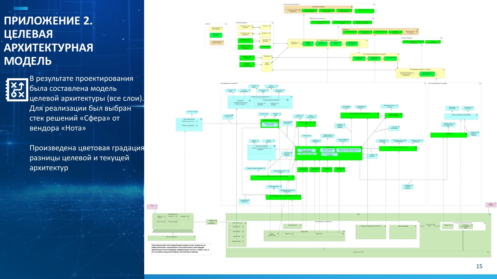

## 13. Detailed migration roadmap

The roadmap sequences organizational, infrastructure, platform and production changes and links them to the three transformation stages.

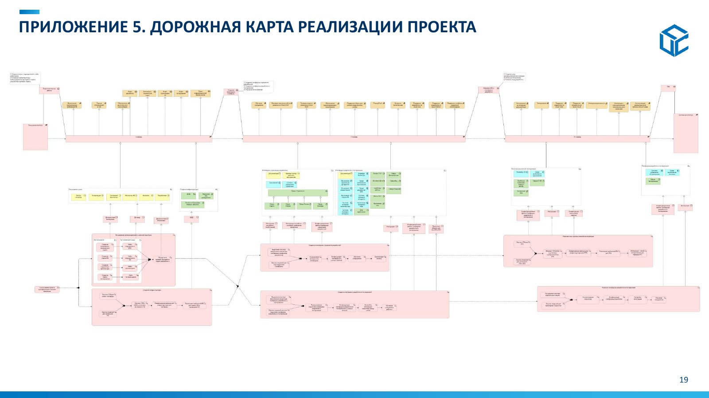

## 14. Detailed GAP matrix

The full matrix preserves the baseline-to-target mapping behind the aggregated GAP summary.

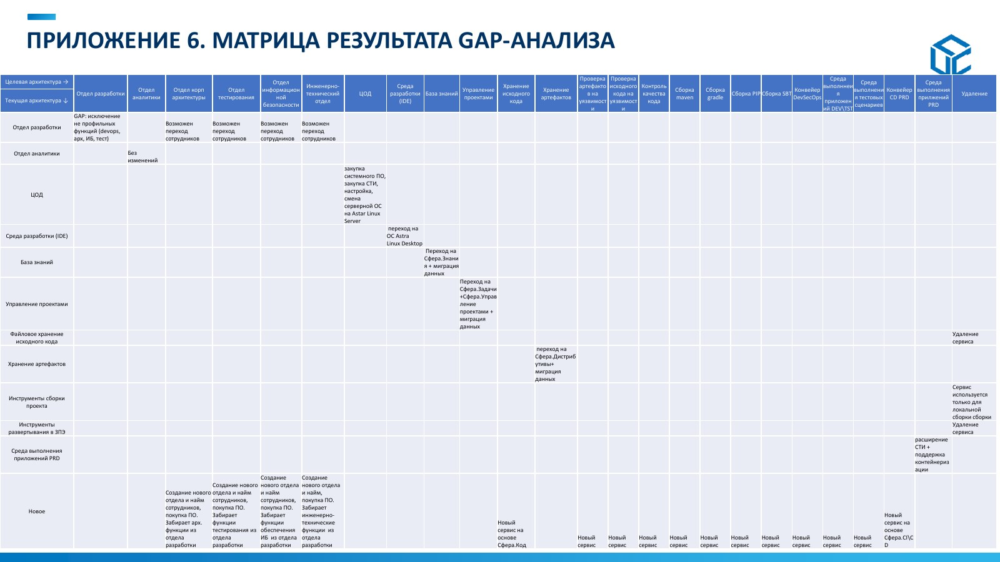

## Detailed appendices

The **[public presentation PDF](diploma-presentation-public.pdf)** also contains the detailed readiness matrix, risk register, functional-role models for architecture / analytics / data, and the full GAP-analysis matrix.
