# Visual walkthrough

These images are rendered from the original authored graduation presentation. Original labels are retained in Russian; the captions below explain the architecture purpose in English.

## 1. Project context

Baseline assumptions, target outcomes and constraints.

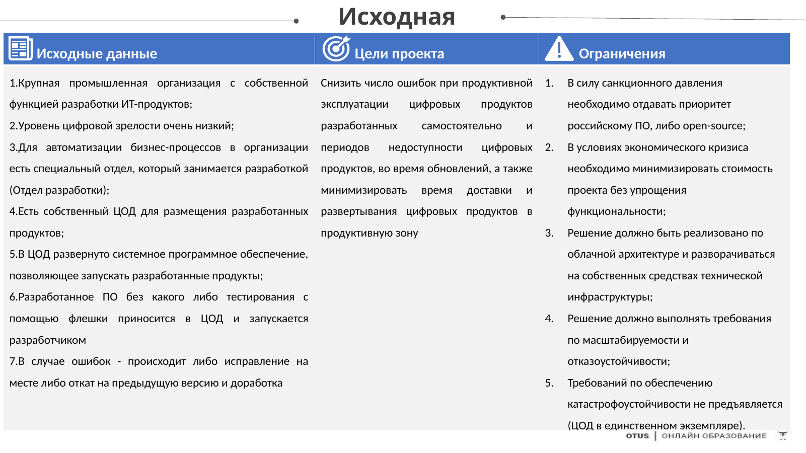

## 2. Motivation model

Stakeholder interviews were translated into drivers, problems, goals and measurable success criteria.

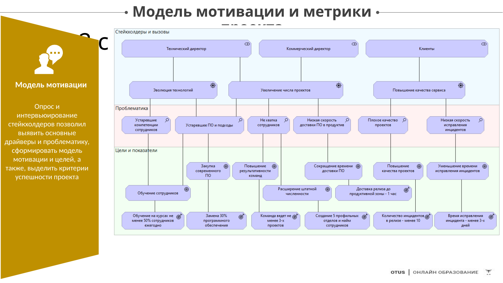

## 3. Capability map

Capability-based planning separates organizational abilities from specific solution products and highlights priority capabilities.

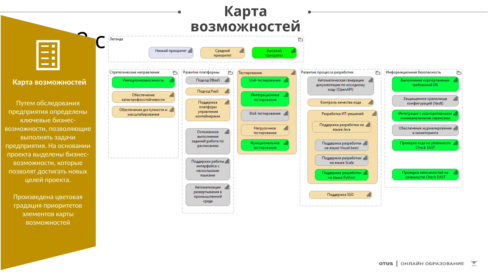

## 4. Change readiness

Readiness assessment identifies strong transformation motivation/investment capacity together with improvement areas in skills, security and employee enablement.

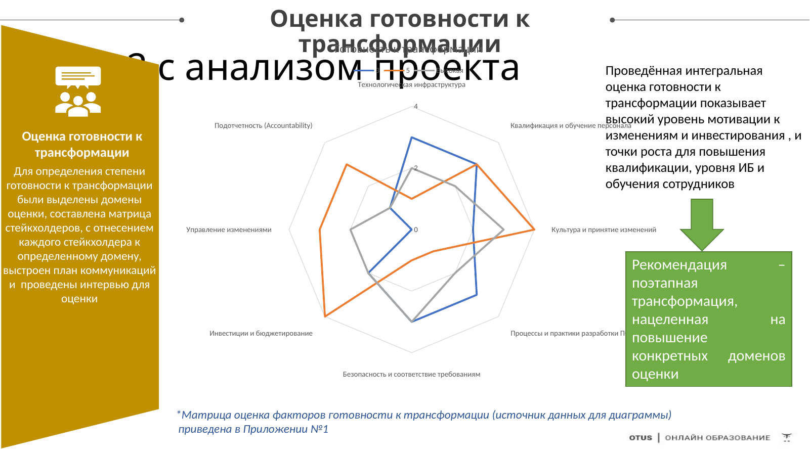

## 5. Project risks

Initial and residual risks are assessed after mitigation and visualized as a heatmap.

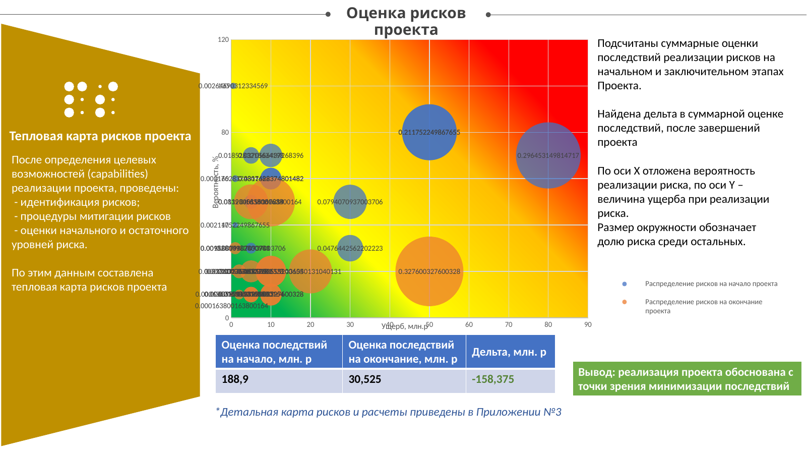

## 6. Software-delivery value stream — AS-IS

The baseline value stream exposes responsibility overlap, workstation-dependent builds, weak testing and manual deployment.

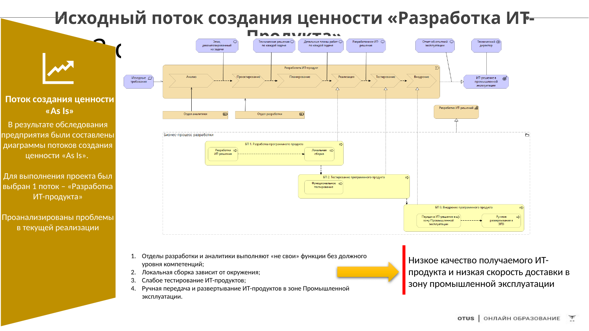

## 7. Software-delivery value stream — TO-BE

The target value stream introduces standardized engineering and platform capabilities.

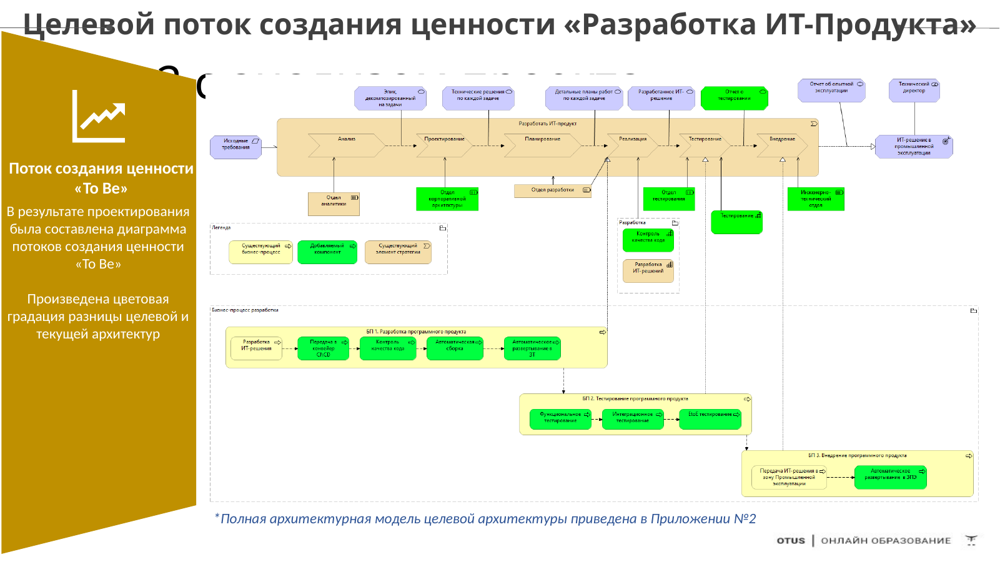

## 8. Architecture function — AS-IS

Architecture is implicit and largely local to delivery teams, leading to uncoordinated project-level decisions.

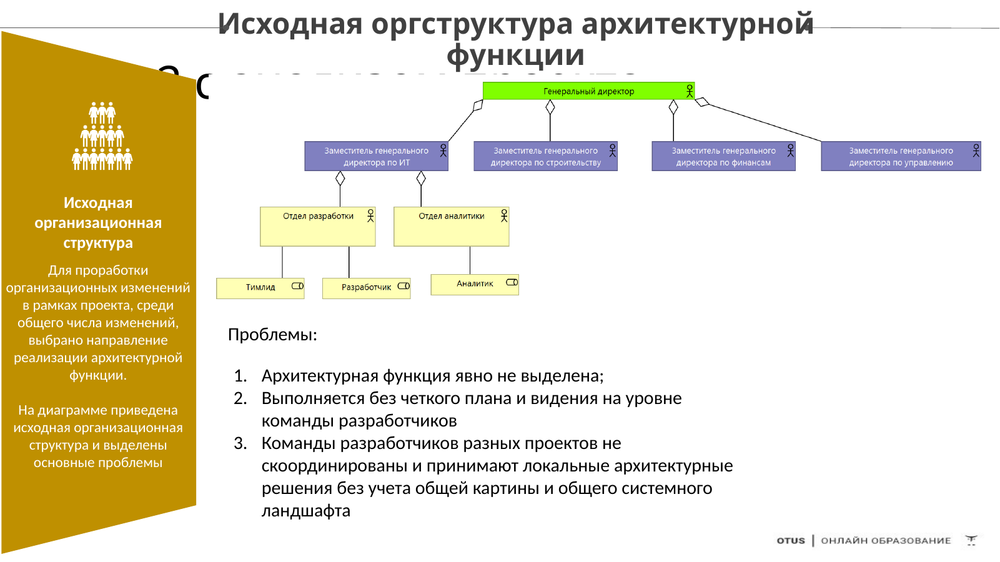

## 9. Architecture function — TO-BE

The target organization establishes explicit competency ownership and a reusable model for forming project architecture teams.

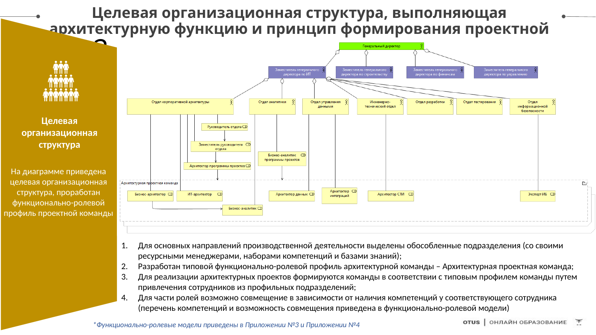

## 10. GAP analysis

The matrix links baseline and target states and identifies the change set required for transformation.

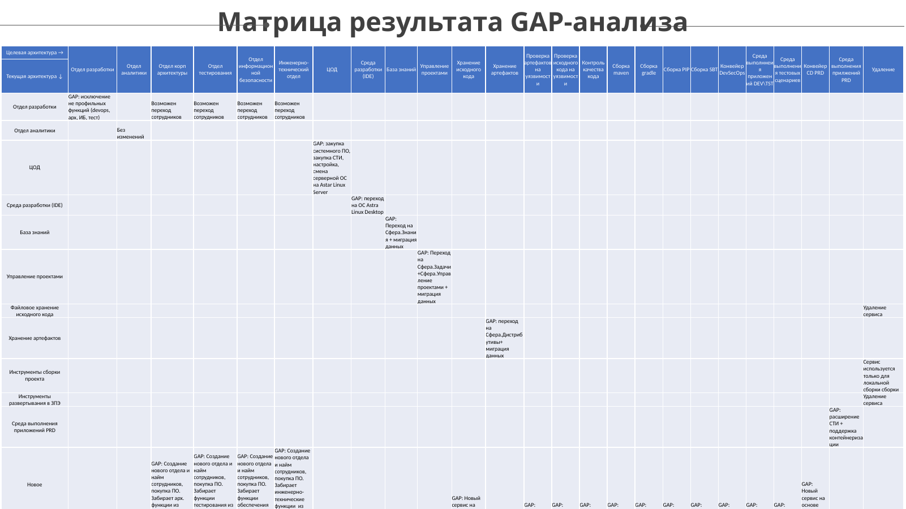

## 11. Transformation stages

Identified GAPs are grouped into three manageable transformation stages.

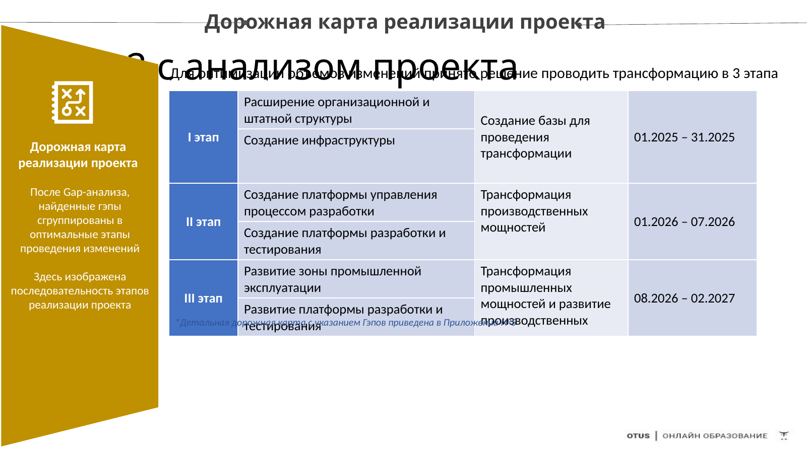

## 12. Target architecture

The complete target view spans business, application and technology layers and uses a concrete development-platform stack as an SBB realization.

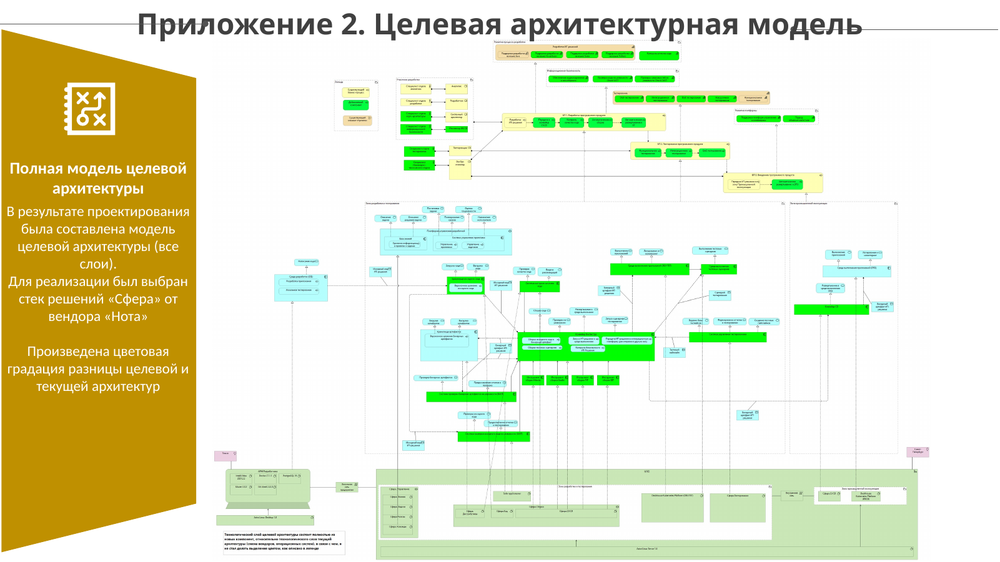

## 13. Migration roadmap

The detailed roadmap sequences architecture changes, work packages and dependencies.

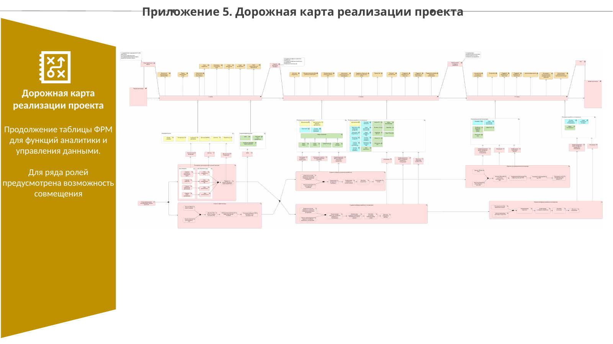
